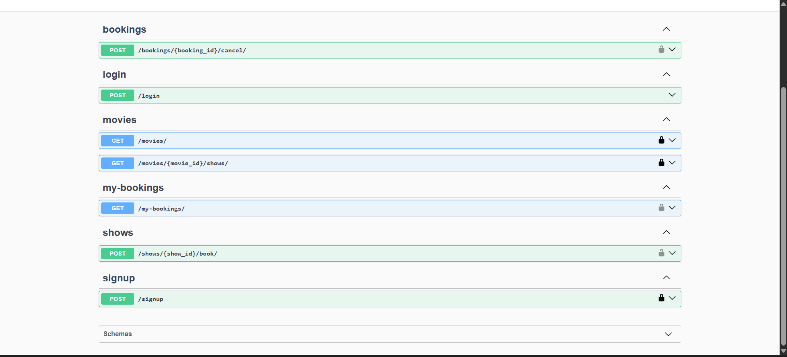

# Movie Ticket Booking API

Backend assignment implemented with Django, Django REST Framework, JWT (SimpleJWT), and Swagger (drf-spectacular).



## Tech Stack
- Python 3.12+
- Django 5.2
- Django REST Framework
- djangorestframework-simplejwt
- drf-spectacular (+ sidecar for Swagger UI)

## Setup Instructions
1. Clone or open the repository locally.
2. Create and activate a virtual environment (Windows PowerShell):
   ```powershell
   python -m venv .venv
   .\.venv\Scripts\python -m pip install --upgrade pip
   .\.venv\Scripts\python -m pip install -r requirements.txt
   ```
3. Run migrations:
   ```powershell
   .\.venv\Scripts\python manage.py makemigrations
   .\.venv\Scripts\python manage.py migrate
   ```
4. Start the development server:
   ```powershell
   .\.venv\Scripts\python manage.py runserver 8000
   ```

## Swagger Documentation
- Open Swagger UI: `http://localhost:8000/swagger/`
- The OpenAPI schema is available at: `/api/schema/`

### Screenshot
The API endpoints exposed in Swagger UI:


## Authentication (JWT)
- Signup: `POST /signup` with body `{ "username": "alice", "password": "secret" }`
- Login (JWT): `POST /login` with body `{ "username": "alice", "password": "secret" }` returns `{ access, refresh }`
- Use the `access` token in the `Authorization` header: `Bearer <token>`

## Endpoints
- `POST /signup` → Register a user
- `POST /login` → Obtain JWT (access/refresh)
- `GET /movies/` → List all movies
- `GET /movies/{movie_id}/shows/` → List shows for a movie
- `POST /shows/{show_id}/book/` → Book a seat (input: `{ "seat_number": <int> }`) [JWT]
- `POST /bookings/{booking_id}/cancel/` → Cancel a booking [JWT]
- `GET /my-bookings/` → List all bookings for the logged-in user [JWT]

## Business Rules
- Prevent double booking: a seat cannot be booked twice (enforced via unique constraint + runtime checks).
- Prevent overbooking: `seat_number` must be within `1..total_seats`.
- Cancelling a booking frees the seat (booking status becomes `cancelled`).
- Security: Users cannot cancel another user's booking.

## Example cURL Requests
```bash
# Signup
curl -X POST http://localhost:8000/signup -H "Content-Type: application/json" \
  -d '{"username":"alice","password":"secret"}'

# Login
curl -X POST http://localhost:8000/login -H "Content-Type: application/json" \
  -d '{"username":"alice","password":"secret"}'

# List movies
curl http://localhost:8000/movies/

# List shows for a movie
curl http://localhost:8000/movies/1/shows/

# Book a seat (replace <ACCESS>)
curl -X POST http://localhost:8000/shows/1/book/ \
  -H "Authorization: Bearer <ACCESS>" -H "Content-Type: application/json" \
  -d '{"seat_number":1}'

# My bookings
curl http://localhost:8000/my-bookings/ -H "Authorization: Bearer <ACCESS>"

# Cancel booking
curl -X POST http://localhost:8000/bookings/1/cancel/ -H "Authorization: Bearer <ACCESS>"
```

## Notes
- Default DB is SQLite; no extra setup required.
- Admin panel available at `/admin/`.
- Concurrency: booking uses DB transaction with `select_for_update` lock on the show to reduce race conditions.
